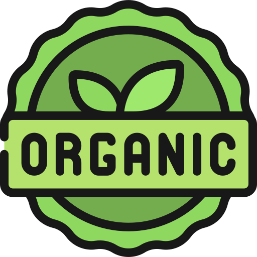

<div align="center">
  
  
  # 🥦 Organic Food Website
  
  <b>Fresh, healthy, and 100% organic products delivered to your doorstep.<br>Supporting local farmers and sustainable living.</b>

  [See The Project](https://organic-food-clean-ghonim.netlify.app/) 
  
  <br>
  <a href="https://www.facebook.com/profile.php?id=61576700668720"></a>
  <a href="https://www.instagram.com/theghonim/"></a>
  <a href="https://www.linkedin.com/in/theghonim/"></a>
</div>

---

## 🚀 Project Overview

Organic Food Website is a modern, responsive web application built with React and Vite. It showcases a selection of organic products, highlights the benefits of organic living, and supports local farmers. The site features a beautiful UI, smooth navigation, and interactive elements for a delightful user experience.

## 🧩 Features

- Modern responsive design with Tailwind CSS
- Hero section, About, Why Us, How It Works, Products, Testimonials, and Footer
- Product cards with images and details
- Scroll-to-top arrow for easy navigation
- Clean code structure and reusable components

## 🛠️ Tech Stack

- React
- Vite
- Tailwind CSS
- React Icons
- React Slick

## 📦 Project Structure

```
src/
  Components/
    About.jsx
    Footer.jsx
    Hero.jsx
    HowSection.jsx
    Navbar.jsx
    Products.jsx
    Testimonial.jsx
    WhyUs.jsx
    Layouts/
      ProductsCard.jsx
  data/
    ProductsData.js
  App.jsx
  App.css
  index.css
  main.jsx
public/
  organic.png
  vite.svg
```


## 🏁 Getting Started

1. **Install dependencies:**
   ```bash
   npm install
   ```
2. **Run the development server:**
   ```bash
   npm run dev
   ```

## 👤 Author

**Abdo Ghonim**  
[Facebook](https://www.facebook.com/profile.php?id=61576700668720) | [Instagram](https://www.instagram.com/theghonim/) | [LinkedIn](https://www.linkedin.com/in/theghonim/)

## 📬 Contact

- 📧 Email: [abdoghonim15@zohomail.com](mailto:abdoghonim15@zohomail.com)
- 💬 DM on social media above

---

<div align="center">
  <b>© 2025 Abdo Ghonim | All rights reserved.</b>
</div>
